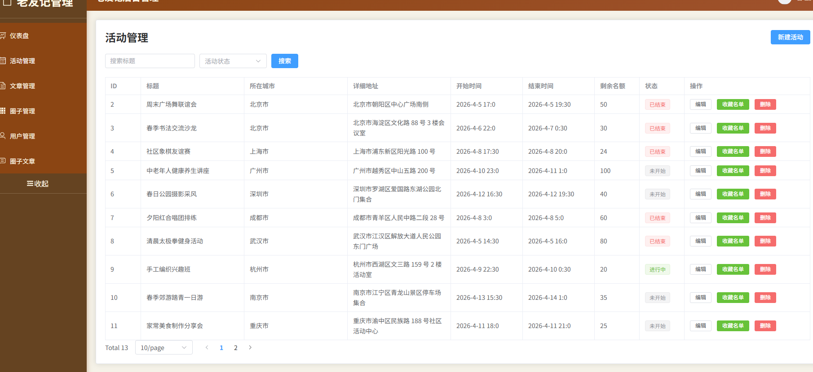
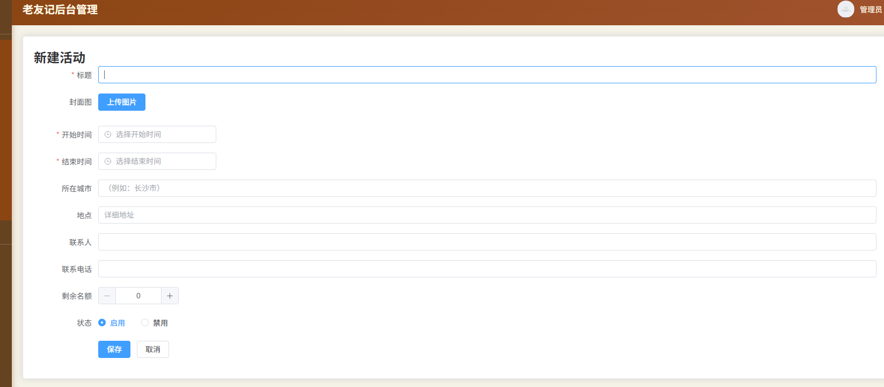
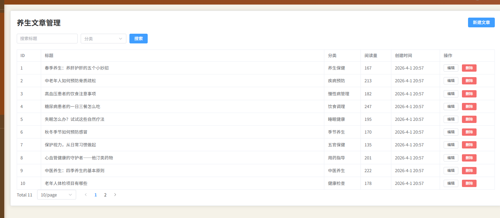
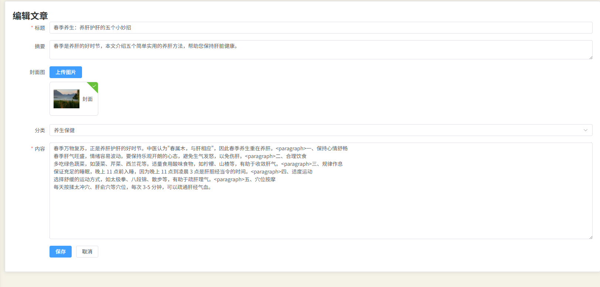
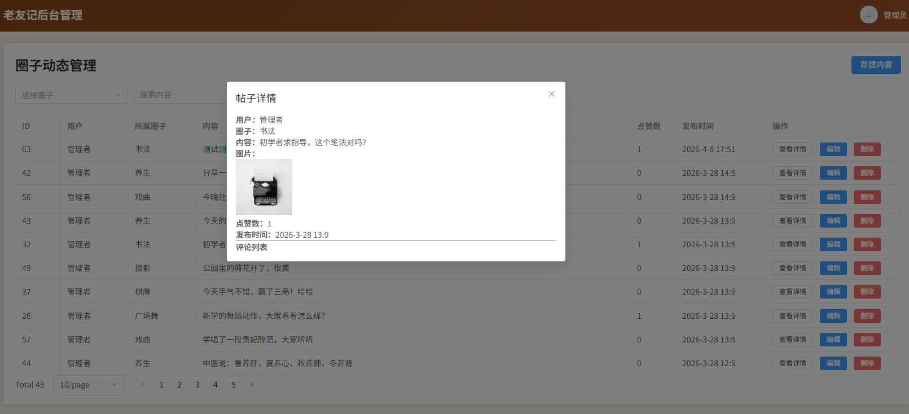
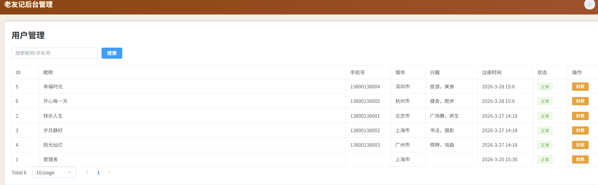

# 老友记——后台管理系统

## 项目简介

银发社交小程序的后台管理系统，用于管理员发布资讯、管理用户等。

## 项目演示

## 技术栈

- Vue3 + Element Plus + Axios
- 后端 API：Node.js + Express + MySQL

## 本地运行

1. 克隆仓库
2. npm install
3. 修改 .env 中的后端地址
4. npm run dev

## 主要功能

- 管理员登录
- 文章增删改查、分页、封面上传
- 状态切换（发布/草稿）

## 项目结构

- src/views/ - 页面
- src/components/ - 组件
- src/api/ - 接口封装
